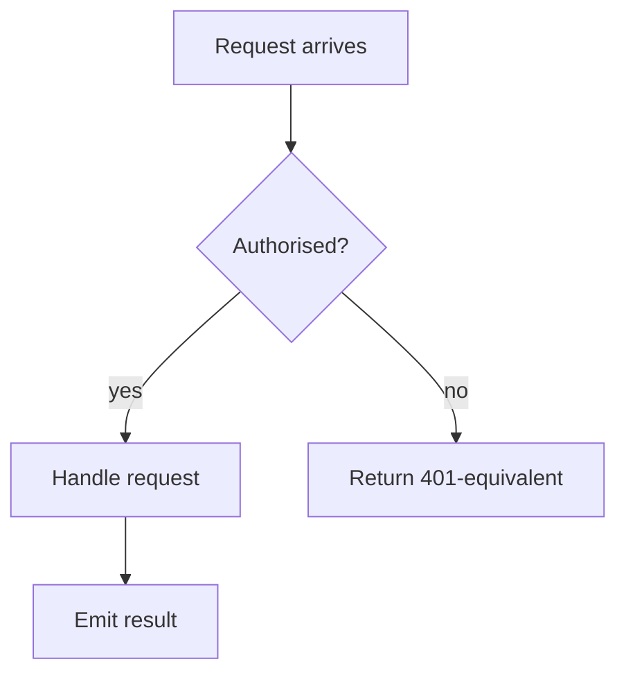
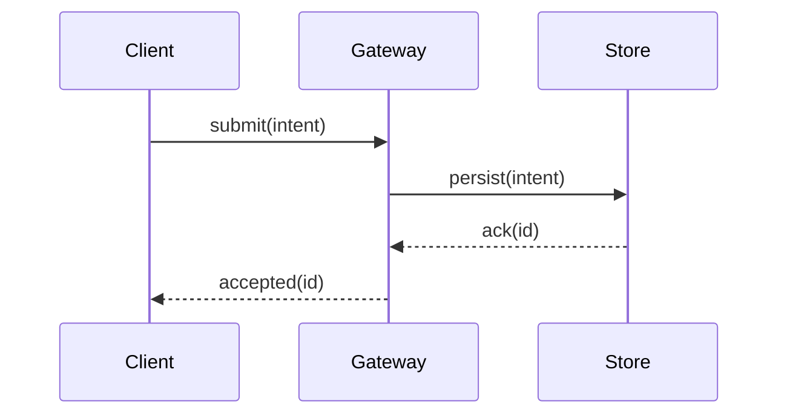
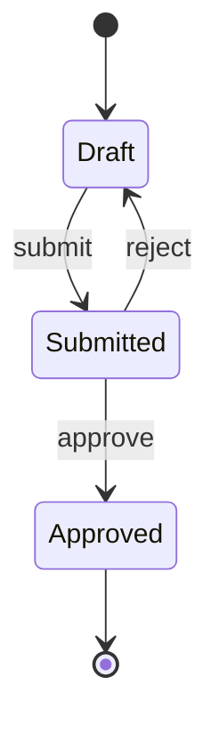
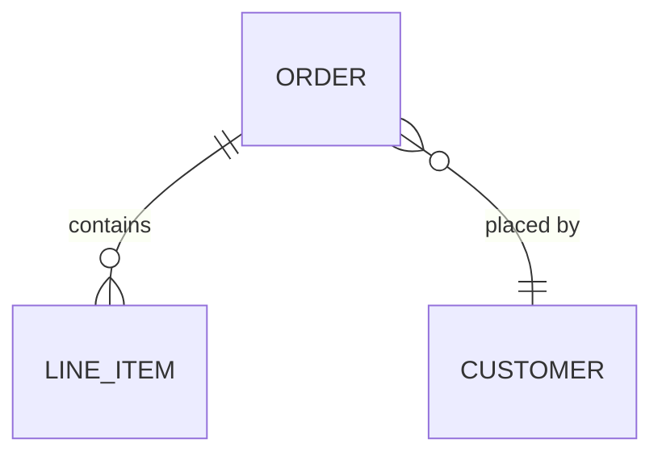

# Diagrams, pseudocode, and code snippets

A specification describes a system, not an implementation. Structure, flow, and
state are always best as **diagrams**; contracts and matrices as **tables**. How
you express *logic*, though, follows the project's recorded **language posture**
(`reference/adr/0001-language-posture.md`):

- **Agnostic** (default) — **pseudocode and numbered steps**, no real-language
  code. The same logic exists no matter what language realises it, so keep it in
  a form that survives the choice.
- **Language-tied, minimal** — pseudocode by default, dropping to a short snippet
  in the recorded language only where a concrete one pins a decision better than
  prose (a state shape, a schema, a tricky invariant).
- **Language-tied, code-forward** — idiomatic snippets in the recorded language
  used **liberally**, alongside the diagrams, to illustrate behaviour and
  contracts. Code is a first-class explanatory tool here, not a rare exception.

Wireframes, mockups, and prototype conventions are scaled by the **UI/UX
posture** (`reference/adr/0002-ui-posture.md`) and live in
[UI-SPEC.md](UI-SPEC.md), not here.

Whichever posture, diagrams still carry structure/flow/state — a code-forward
spec is snippets *and* diagrams, not a code dump. When you do write a snippet,
keep it tight and illustrative: the decision-rich bit, not a full implementation
with error handling and imports.

## Mermaid diagrams

Mermaid renders on the site automatically (themed to match the gruvbox palette).
Fence it as `mermaid`. Reach for the diagram type that fits the relationship —
don't make every diagram a flowchart.

**Flowchart** — control flow, decisions, pipelines:

````markdown

````

**Sequence** — who talks to whom, in what order, across components:

````markdown

````

**State** — lifecycles and transitions (an entity's allowed states):

````markdown

````

**Entity relationship** — data shapes and cardinality, without committing to a schema language:

````markdown

````

Keep diagrams focused — one relationship per diagram. If a diagram needs a
paragraph to be understood, it's doing too much; split it or simplify it.

## Pseudocode

When you need to pin down logic, write pseudocode that reads like structured
prose — no language's syntax, no real APIs. Name the steps in the project's
glossary terms.

```
on receiving an Intent:
    if the Intent fails validation:
        record the reason and reject it
    else:
        assign it a stable Id
        append it to the durable log
        return the Id to the caller
```

For decision logic, a numbered list or a small table of conditions → outcomes is
often clearer than a code block. Use whichever makes the rule unambiguous.

## Tables for contracts

Field specs, capability matrices, event payloads, and condition→action rules
read best as tables — they force you to be precise about what's required and
what each thing means:

```markdown
| Field | Required | Meaning |
|-------|----------|---------|
| id    | yes      | Stable identifier assigned on intake |
| state | yes      | One of: draft, submitted, approved |
```

## Admonitions

The site supports callouts for emphasis (rendered as styled boxes):

```markdown
!!! note
    A clarification the reader needs but that would interrupt the main flow.

!!! warning
    A constraint or gotcha that will bite if ignored.
```

## The test

Before committing a file, ask: *would this still be correct if the system were
built in a completely different language or stack?* If a sentence only makes
sense for one language, rewrite it as the underlying rule. The spec captures the
decision; the implementation plan and the eventual code capture the realisation.
